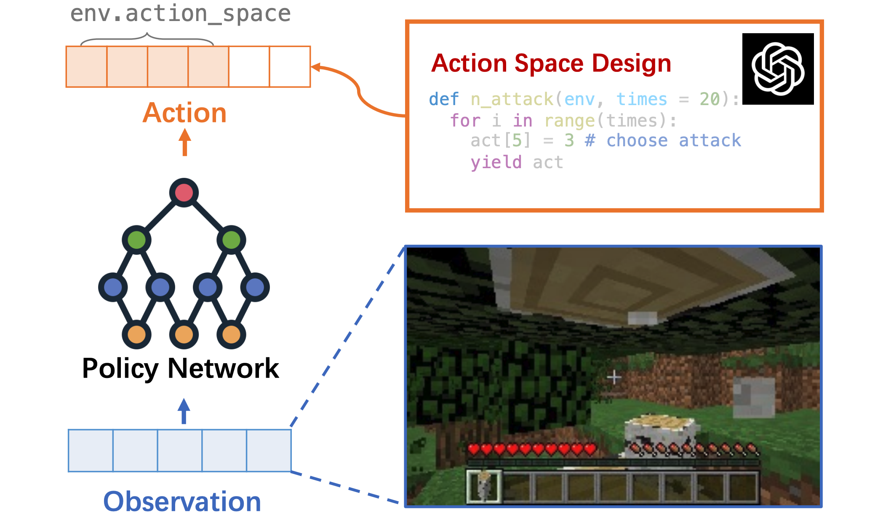
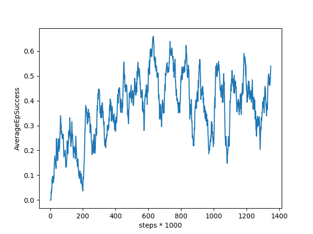
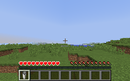
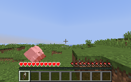

# RL-GPT: Integrating Reinforcement Learning and Code-as-policy

<a href='https://sites.google.com/view/rl-gpt'></a>
<a href='https://arxiv.org/abs/2311.17043'></a>
<a href='https://arxiv.org/abs/2311.17043'></a>

**Combine LLMs and RL**: The LLM reasons about the agent's behavior to solve subtasks and generates higher-level actions, improving RL's sample efficiency.

<!-- <div align=center> -->
<div align=left>

</div>

## Contents
- [Install](#install)
- [PPO-Training](#ppo-training)
- [Results](#results)
- [Citation](#citation)
- [Acknowledgement](#acknowledgement)
- [License](#license)

## Install

- Install MineDojo environment: the official document is: https://docs.minedojo.org/sections/getting_started/install.html#prerequisites. 

- Follow my steps:
	- Create python 3.9 environment in anaconda.
	- Install jdk version 171, otherwise you may see some error with Malmo. The package is in the resource link. After installation, you can see the version via `java -version`.
	- Install dependencies `sudo apt install xvfb xserver-xephyr python-opengl ffmpeg`.
	- pip install minedojo
	- If successfully installed, you can run `MINEDOJO_HEADLESS=1 python validate_install.py`.

- Modify MineDojo package: 
	- Delete the official package `pip uninstall minedojo`.
	- Download our repo https://github.com/PKU-RL/MCEnv. Run `python setup.py install`. 
	- For different tasks, carefully check our fast_reset option.

- Install MineCLIP: `pip install git+https://github.com/MineDojo/MineCLIP`, or use the package in the resource link.

- Use PyTorch>=1.8.1. Require x-transformers==0.27.1, otherwise the CLIP model cannot be loaded.

- Check the arguments in train.py.  Download the pretrained MineCLIP model `adjust.pth`  in the resource link.

## PPO-Training

- For PPO, run `MINEDOJO_HEADLESS=1 python train.py`.   
	\-\-task: the programmatic task name.

	\-\-exp-name:  specify dir name prefix of saved logs and models.

	\-\-save-path: this log dir will save models and gifs. 

	Model, gif videos and experience are saved in checkpoint/. Training configs and logs are saved in data/.

- **Draw training curves:** find the training log file progress.txt in data/, move `vis.py` into its directory and run.

<div align=left>

</div>

## Results

- For milk & wool, the --task is harvest_milk_with_empty_bucket_and_cow and harvest_wool_with_shears_and_sheep. `fig/` shows our training results.

- For other tasks, you may refer to the paper and modify the environment `minecraft.py`, to specify the simulation and reward function.

|milk|wool|
|---|---|
|||

## Citation
```
@misc{liu2024rlgptintegratingreinforcementlearning,
      title={RL-GPT: Integrating Reinforcement Learning and Code-as-policy},
      author={Shaoteng Liu and Haoqi Yuan and Minda Hu and Yanwei Li and Yukang Chen and Shu Liu and Zongqing Lu and Jiaya Jia},
      year={2024},
      url={https://arxiv.org/abs/2402.19299},
}
```

## Acknowledgement
- A multi-task agent in Minecraft [Plan4MC](https://github.com/PKU-RL/Plan4MC).
- The first LLM-powered lifelong learning agent in Minecraft [Voyager](https://github.com/MineDojo/Voyager).
- Many practical prompts and tools. in [DEPS](https://github.com/CraftJarvis/MC-Planner).